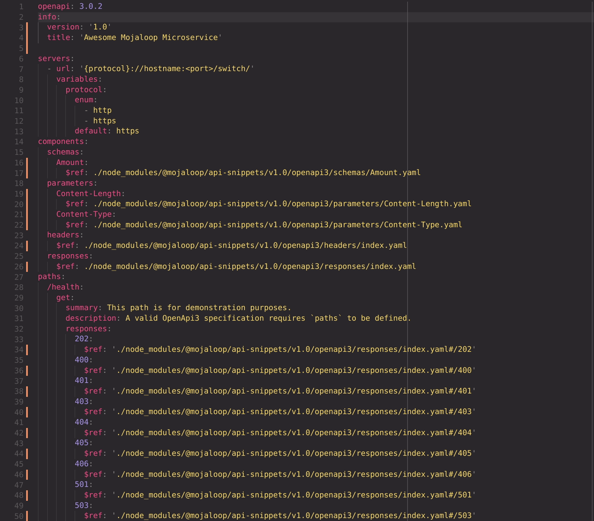

# api-snippets

## Swagger UI Api Preview

https://docs.mojaloop.io/api-snippets/

## Usage

Install the snippet library
```bash
  npm install @mojaloop/api-snippets --save-dev
```

Install the reference resolving library
```bash
  npm install swagger-cli --save-dev
```

Modify swagger file to reference `api-snippets`.

ex.
```yaml
Money:
  $ref: /path/to/node_modules/@mojaloop/api-snippets/v1.0/openapi3/schemas/Money.yaml
```

Render and resolve the references.
```bash
  swagger-cli bundle -t yaml -o api_render.yaml api.yaml
```

Validate the result file.
```bash
  swagger-cli validate api_render.yaml
```

## Quick Demonstration


## Swagger-UI

The snippets specification is previewable using swagger-ui. Swagger-UI files
are found in `docs/dist/`. Github pages uses the master branch `docs/` folder
to build the page found at https://docs.mojaloop.io/api-snippets/

## Dev Tools

To create snippets the tool found at https://www.npmjs.com/package/evrythng-openapi-tools
was used to break up large specification files. Some manual edits to the paths
are needed to format the files.

TODO: Add more detailed instructions for this workflow.
- `npm i -g evrythng-openapi-tools`
- `evrythng-openapi-tools split /path/to/my-large-specifcation-file.yaml /path/to/output-directory/`

## Questions

1) Are paths in the Mojaloop Specification considered "snippets"? Are they re-used widely across services?
2) Do we need to support both Swagger 2.0 and Open Api 3?
3) Does it make sense to have a common folder between versions for specification snippets that never change
   to cut down on files?
